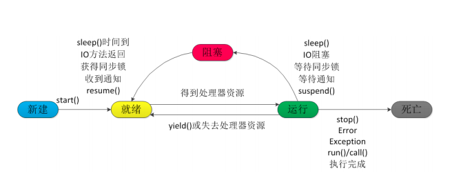
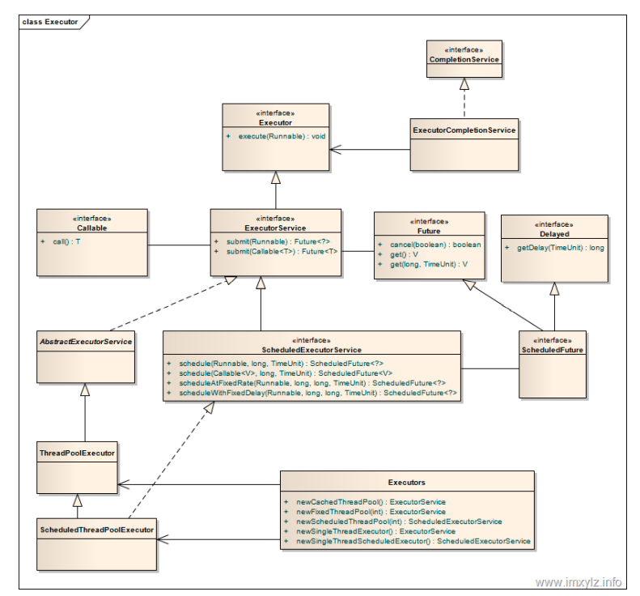

# 
JAVA线程学习笔记 

## JAVA线程基本概念

- JAVA线程状态：
    1. 新建(New): new Thread对象 JVM分配内存并初始化成员变量
    2. 就绪（Runnable）: 调用了start() 方法，线程进入就绪状态等待CPU调度
    3. 运行（Running）:CPU调用线程并执行run方法
    4. 阻塞(Blocked) :线程因某种原因放弃使用CPU
        1. 等待阻塞：（调用wait方法,线程进入等待队列。等待其他线程调用notify或notifyAll方法来唤起线程）
        2. 同步阻塞：（同步锁被其他线程占用，线程进入锁池。等待锁被释放）
        3. 其他阻塞：（执行 sleep、join 等方法时线程进入阻塞状态，*sleep方法执行后线程不会释放锁）
    5. 死亡(Dead):
        1. 正常结束：run 或 call 方法结束
        2. 异常结束：抛出未捕获的异常或错误
        3. 调用stop方法
    
- JAVA 线程创建方式：
    1. 继承Thread类并进行run方法的重写
        1. sleep 和 wait 区别：  
        === wait 方法时Object 类中的方法。  
        === wait 会释放线程在对象上的锁并进入等待队列。sleep不会释放对象上的锁
        2. start 和 run 区别：  
        === 调用 Thread 类的 start()方法来启动一个线程， 这时此线程是处于就绪状态， 并没有运
            行。
        === run方法是线程体当线程获得执行权限后执行方法体中的内容    
           
    2. 实现 Runnable 接口，并使用 Thread 初始化线程
    
    * 线程池：线程池可以避免线程的频繁创建和销毁提高线程利用率
          
        Executor ：线程池的顶级接口（线程池执行方法接口）
        ExecutorService：线程池基本方法的定义（真正线程池接口）   了解 ThreadPoolExecutor 实现类
            1. 线程池管理器：用于创建并管理线程池
            2. 工作线程：线程池中的线程
            3. 任务接口：每个任务必须实现的接口，用于工作线程调度其运行
            4. 任务队列：用于存放待处理的任务，提供一种缓冲机制
            
            1. corePoolSize：指定了线程池中的线程数量。
            2. maximumPoolSize：指定了线程池中的最大线程数量。
            3. keepAliveTime：当前线程池数量超过 corePoolSize 时，多余的空闲线程的存活时间，即多次时间内会被销毁。
            4. unit：keepAliveTime 的单位。
            5. workQueue：任务队列，被提交但尚未被执行的任务。（用于存放待处理的任务，提供一种缓冲机制）
            6. threadFactory：线程工厂，用于创建线程，一般用默认的即可。
            7. handler：拒绝策略，当任务太多来不及处理，如何拒绝任务。

        RunnableFuture： 、继承了Future和Runnable接口，定义执行线程后返回的内容。具体实现类有FutureTask
        AbstractExecutorService：抽象线程池方法类。实现的方法类有ThreadPoolExecutor等线程池类。ScheduledThreadPoolExecutor是在ThreadPoolExecutor基础上实现了ScheduledExecutorService的类
        
- JAVA 中的锁：